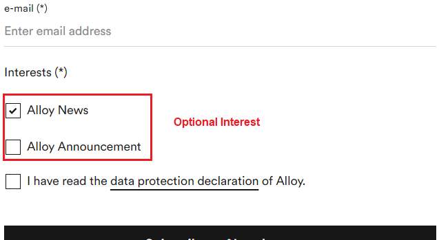

# A2Z.EPiServer.MarketingAutomationIntegration.Mailchimp

## Description
[](https://docs.microsoft.com/en-us/dotnet/)
[](https://docs.microsoft.com/en-us/dotnet/)
[](http://world.episerver.com/cms/)
[](http://world.episerver.com/cms/)


The A2Z.EPiServer.MarketingAutomationIntegration.Mailchimp package enhances Optimizely Forms by seamlessly integrating with Mailchimp, catering to both developers and marketers. It moves beyond the traditional use of Mailchimp's embedded forms for email list collection, enabling direct connection and data posting to a Mailchimp list via its API. This integration simplifies email marketing automation within Optimizely, offering a streamlined approach to audience engagement.

### *This addon draws significant inspiration from a blog post by [Joshua Folkerts](https://world.optimizely.com/blogs/Joshua-Folkerts/Dates/2019/2/episerver-form-mailchimp-integration/).

## Installation

The command below will install the addon in your Optimizely project.

```
dotnet add package A2Z.EPiServer.MarketingAutomationIntegration.Mailchimp
```

## Configuration

### "[A2Z] Mailchimp Cache Manager"  Scheduled Job

This package enhances performance by using a scheduled job ([A2Z] Mailchimp Cache Manager) to preload items, offering a more efficient solution than the standard method of on-demand caching at the first request. The usual technique may introduce a brief delay while the system sets up the cache for the first time. To circumvent this, it's advisable to set up a scheduled job that pre-fills the cache for the forms, thus removing the necessity for immediate data fetch from Mailchimp during load times. The procedure entails retrieving all Mailchimp lists and then going through these lists to gather all pertinent fields, guaranteeing immediate availability of data without any waiting period.

### Startup.cs

Add the `AddMarketingAutomationMailchimp` handler in the `Startup.cs` within the `ConfigureServices` method. Here's an example with all available configurations:

```C#
public void ConfigureServices(IServiceCollection services)
{   
    services.AddMarketingAutomationMailchimp(o =>
    {
        o.MailChimpApiKey = "ApiKey";
        o.RequiredInterests = new List<string> { "b5423646b8", "f24a1b729b" };
        o.OptionalInterests = new List<OptionalInterest>
        {
            new()
            {
                Key = "Alloy News", Value = "a5423146b8"
            },
            new()
            {
                Key = "Alloy Announcements", Value = "d24e1f719b"
            }
        };
    });
...
}
```

In addition, the configuration can be read from the `appsettings.json`:

```Json
"A2Z": {
    "AddMarketingAutomationMailchimp": {
        "MailChimpApiKey": "ApiKey",
        "RequiredInterests": ["a5423146b8", "d24e1f719b"],
        "OptionalInterests": [
            {
                "Key": "Alloy News",
                "Value": "a5423146b8"
            },
            {
                "Key": "Alloy Announcements",
                "Value": "d24e1f719b"
            }
        ]
    }
}
```

The settings specified in the `appsettings.json` file will take precedence over any configurations defined in the Startup.

## Usage

Now that the scheduled job has primed the cache, let's dive into what this setup looks like for an editor.

To start, build a form in Episerver. For illustration purposes, I've incorporated a straightforward form into the Alloy Demo, featuring three text fields (FirstName, LastName, EmailAddress) and a submit button.


Next, we link this form to a Mailchimp list. Editors will find a new "Mappings" tab within the form container block.

The dropdown menu here is populated with Mailchimp Lists that have been cached by the scheduled job. Editors will be greeted with an interface similar to what's described below, but it will display your specific Mailchimp Lists in the dropdown.


In this scenario, editors will choose "Episerver Forms Sample" from the dropdown, indicating the desire to map that specific form to the Mailchimp list. After publishing the form, editors must then link the form elements to the corresponding fields in our Mailchimp list. These fields are available from the "Columns" Field of the selected datasource as shown in the image previously mentioned.


Keep in mind that Mailchimp requires the `Email` field, making it a crucial factor when integrating Mailchimp with Optimizely. The list expects specific fields; in our scenario, we utilized First Name, Last Name, and Email. In this instance, we'll initially select the First Name field before moving forward to publish the form.

### Interest

Interests are fields in Mailchimp that cannot be directly mapped in Optimizely forms and are compatible with the `Multiple or single choice` form element.



Interest values, such as d24e1f719b, must be obtained from Mailchimp. Interests can be categorized as `Optional` or `Required`.

`Required Interests` are included with every form submission.

`Optional Interests` are submitted only if the Multiple or single choice element is marked as true by the user during the form submission process.


## Contributing

Feel free to submit a pull request if you identify any areas that could be enhanced or improved.

## Feature Requests

If you have new ideas or feature requests that can make this tool even more useful for you or the community, please feel free to open a new issue at the following link.

https://github.com/adnanzameer/A2Z.EPiServer.MarketingAutomationIntegration.Mailchimp/issues

## Changelog

[Changelog](CHANGELOG.md)
